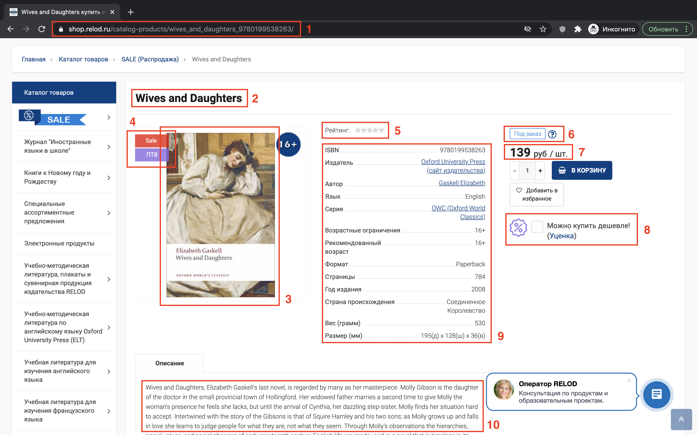

# Домашнее задание №3

В этом задании требуется обкачать книжный магазин ["Relod"](https://shop.relod.ru/) с использованием библиотек [BeautifulSoup](https://www.crummy.com/software/BeautifulSoup/bs4/doc/) и/или [lxml](https://lxml.de/). Ваша программа должна скачать информацию о самых популярных 5000 книг из раздела ["Художественная литература"](https://shop.relod.ru/catalog-products/4577/?sort=PROPERTY_RATING&order=desc) .

Результатом работы вашей программы должен быть файл `hw_3.csv` с таблицей из всех найденных книг.

## Общий подход к решению задачи

Задачу условно можно разделить на три этапа. На первом этапе требуется получить ссылки на все нужные книги из раздела, на втором – получить информацию о каждой из книг, на третьем – сгруппировать информацию обо всех книгах в одну таблицу.

### Этап 1. Получение ссылок на книги раздела

Для получения всех ссылок на книги нужно обкачать первые 250 страниц раздела. Существует два способа это сделать.

#### Способ 1. Простой

Переключаясь между страницами раздела можно заметить, как меняется URL страницы (появляется параметр `PAGEN_1`). Варьируя это значение в диапазоне от 1 до 250 можно обкачать все требуемые страницы.

#### Способ 2. Быстрый

Внизу страницы находится кнопка "Показать ещё", нажимая на которую происходит подгрузка выдачи карточек книг со следующей страницы. Нужно сэмулировать поведение при нажатии на эту кнопку (**БЕЗ** использования библиотеки [selenium](https://selenium-python.readthedocs.io/getting-started.html)). В исследовании поведения рекомендуется воспользоваться [консолью браузера](https://learn.javascript.ru/devtools).

Проверить, что у вас нет дубликатов карточек можно, например, через `set`:
```python
assert len(cards) == len(set(cards))
```

### Этап 2. Получение информации о книгах

Рассмотрим в качестве примера [карточку](https://shop.relod.ru/catalog-products/wives_and_daughters_9780199538263/) книги Элизабет Гаскелл «Жёны и дочери».



На скриншотах выделены 10 областей, из каждой области требуется извлечь следующие элементы:
1. поле "URL" (ссылка на книгу);
2. поле "Название";
3. поле "Иллюстрации" (список из ссылок на изображения, предоставленные к книге);
4. поле "Метки" (список меток, всего их 4 вида: Sale, New, Хит, ПТВ);
5. поля "Оценка" и "Число голосов" (количество звезд у книги и количество пользователей, оценивших книгу);
6. поле "Наличие" (товар в наличии или доступен под заказ);
7. поле "Цена";
8. поле "Цена (скидка)" (цена уцененного товара, ее можно увидеть на сайте проставив галочку);
9. все поля из таблицы;
10. поле "Описание".

Поле "Описание" не должно содержать пробельных символов за исключением самого пробела, т.е., например, символы `\n`, `\r`, `\t` не допустимы. Для удаления пробельных символов рекомендуется пользоваться регулярными выражениями с использованием шаблона `\s+`.

Таким образом карточка из примера представима в виде следующего json-а:
```json
{
    "url": "https://shop.relod.ru/catalog-products/wives_and_daughters_9780199538263/",
    "Название": "Wives and Daughters",
    "Оценка": 0,
    "Число голосов": 0,
    "Наличие": "Под заказ",
    "Цена": 139.0,
    "Цена (скидка)": 111.2,
    "Метки": [
        "Sale",
        "ПТВ"
    ],
    "Описание": "Wives and Daughters, Elizabeth Gaskell's last novel, is regarded by many as her masterpiece. Molly Gibson is the daughter of the doctor in the small provincial town of Hollingford. ...",
    "Иллюстрации": [
        "https://opt-1458870.ssl.1c-bitrix-cdn.ru/upload/iblock/b56/b5612e1932cafcd6cf5f0895eab8c426.jpg?153149314326232"
    ],
    "ISBN": "9780199538263",
    "Издатель": "Oxford University Press",
    "Автор": "Gaskell Elizabeth",
    "Язык": "English",
    "Серия": "OWC (Oxford World Classics)",
    "Возрастные ограничения": "16+",
    "Рекомендованный возраст": "16+",
    "Формат": "Paperback",
    "Страницы": "784",
    "Год издания": "2008",
    "Страна происхождения": "Соединенное Королевство",
    "Вес (грамм)": "530",
    "Размер (мм)": "195(д) х 128(ш) х 36(в)"
}
```
Обратите внимание, что некоторые поля из таблицы, например: "Носитель", "Серия", "Уровень" — отсутствуют именно для этой карточки, но могут присутствовать в других карточках, см. таблицу, например, [карточки #1](https://shop.relod.ru/catalog-products/new-enterprise-a2-student-s-book-with-digibooks-application/).

**Замечание:** Не нужно создавать поля со значением `null` (python-ий `None`) или пустыми строками. Сохраняйте только те поля, которые есть у карточки.

Далее будем полагать, что у нас есть функция `process_page(url)`, которая для карточки с ссылкой `url` возвращает описанный выше словарь.

Для удобства вам предоставлен файл [`example.jsonl`](example.jsonl) с результатами парсинга некоторых карточек.

#### Параллелизация обкачки

Так как большую часть времени парсинга занимают скачивание карточки (I/O-операция) и обращения к библиотекам парсинга (имеют основу, написанную на C++), можно воспользоваться параллелизацией с использованием потоков.

Для того, чтобы не хранить все скачанные карточки в оперативной памяти, посадим каждый поток на свой файл:
* поток зачитывает URL из очереди;
* скачивает и парсит страницу;
* результат сохраняет в файл.

Данную логику можно реализовать, например, следующим образом:

```python
import gzip
import json
import codecs

from multiprocessing.dummy import Pool, Queue

queue = Queue(...)   # очередь ссылок на книги


def process_page_wrapper(i):
    with gzip.open('data/part_{:05d}.jsonl.gz'.format(i), mode='wb') as f_json:
        f_json = codecs.getwriter('utf8')(f_json)

        while not queue.empty():
            record = process_page(queue.get())
            record_str = json.dumps(record, ensure_ascii=False)
            print(record_str, file=f_json)

            # счетчик должен атомарно обновиться
            with lock:
                pbar.update(1)


with Pool(processes=8) as pool, tqdm(total=queue.qsize()) as pbar:
    lock = pbar.get_lock()
    pool.map(process_page_wrapper, range(pool._processes))
```

**Замечание:** приведенная выше реализация не является законченной, требуется добавить логирование ошибок (какая страница не смогла быть обработана и почему). Для логирования можно использовать `print`:
```python
print(message, file=sys.stderr)
```
Не забывайте при логировании использовать `lock`.

### Этап 3. Объединение результатов

Теперь остается объединить все файлы вместе. Предлагается написать генератор `records_reader(dirname)`, который будет зачитывать записи (словарь) из всех файлов. Тогда итоговый `pd.DataFrame` можно будет сформировать следующим образом:

```python
import pandas as pd

from itertools import chain         # рекомендуется использовать
from contextlib import ExitStack    # рекомендуется использовать

from typing import Generator, Dict, Any


def records_reader(dirname: str) -> Generator[Dict[str, Any], None, None]:
    # ваша реализация
    pass


df = pd.DataFrame(records_reader('data'))
df.to_csv('hw_3.csv', index=False)
```

Для удобства вам предоставлен файл [`example.csv`](example.csv) с примером финальной таблицы.

## Общие рекомендации по выполнению задания

1. В данном задании вы строите небольшую, но все же, систему для обкачки сайтов. Поэтому полезно мониторить ее состояние, например, писать сколько книг уже было обработано. Для этого можно пользоваться библиотекой [tqdm](https://tqdm.github.io/). 
2. Не смешивайте этапы задания вместе. Сначала получите все url-ы карточек, а затем для каждой карточки извлеките требуемую информацию.
3. Используйте возможности параллельной работы с данными Python, например, модуль multiprocessing.
4. Помните, что парсинг страниц очень нестабильный процесс, поэтому требуется сделать ваш код максимально безопасным: явно проверять извлечение каждого из полей (делать соответствующие проверки), проверять что страница скачана (если страница не скачана, то попробовать ее перекачать) и т.п.
5. Если страницу не получается скачать, попробуйте скачать ее еще раз. Например, можно реализовать функцию:
```python
def get_page(url, n_attempts=5, t_sleep=1, **kwargs):
    pass
```
6. Старайтесь не искать каждый элемент по ВСЕЙ странице. Если элементы расположены в одном блоке, то лучше сначала найти этот общий блок, а затем элементы уже внутри этого блока.
